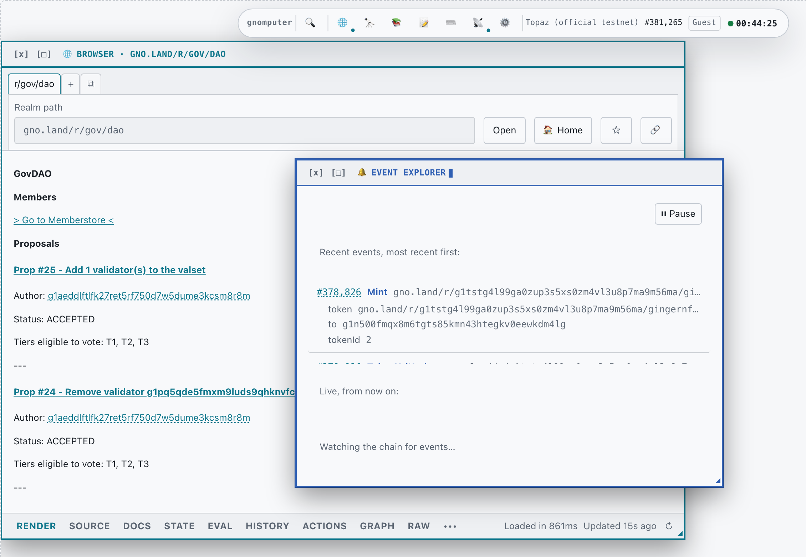
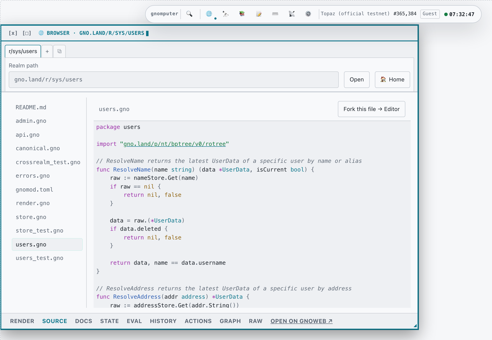
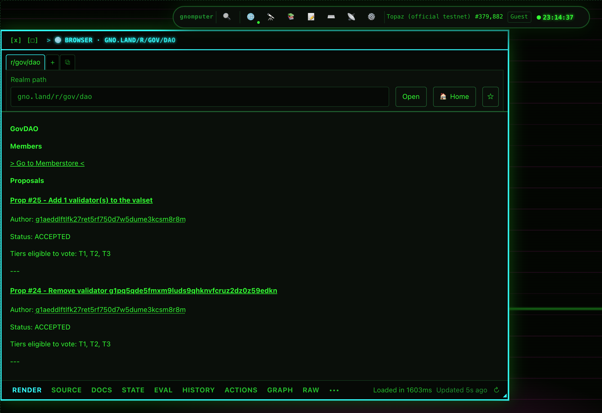
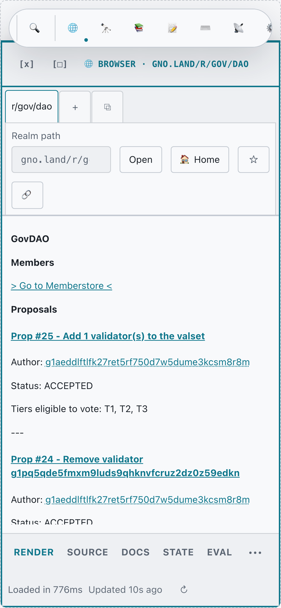

# Gnomputer

**A windowed desktop for the Gno chain, running entirely in your browser.**

Open a realm, read the source it was deployed from, watch transactions land, inspect
state — side by side, in resizable windows, against a live chain. No wallet, no signup,
no install.

### ▶ [Try it](https://moul.github.io/gnomputer/) &nbsp;·&nbsp; 🎬 [Watch a 30-second tour](docs/demo.mp4)



---

## Why it's different

**Everything is live chain data.** Nothing in the running app is mocked or seeded. The
proposals in that screenshot are real GovDAO proposals, and the events beside them are
real events at the block height shown in the bar.

**It reads source from the chain, not from GitHub.** Open any realm and its actual
deployed `.gno` files are there, syntax-highlighted, with imports clickable through to
the packages they reference.



**It's a desktop, not a page.** Several realms open at once, windows you can drag,
resize and maximize, an overview mode, a command palette (⌘K), and per-realm lens tabs
— Render, Source, Docs, State, Eval, History, Actions, Graph, Raw.

**Read-only by default, and honest about it.** Guest mode needs nothing from you. Where
data comes from an indexer rather than the chain itself, it says so next to the
timestamp, because a freshly-fetched but stale answer looks identical otherwise.

**It starts you somewhere.** A first visit offers three things to click, not three
things to read — live governance, a realm's on-chain source, events landing as blocks
arrive. Each one proves the "this is live" claim faster than a paragraph asserting it.

**Six themes, including one that commits.**



---

## What's in it

Real, live data from Gno testnets — Sapphire by default, also Topaz, betanet, a local
`gnodev` option, and any custom RPC endpoint you add.

| | |
|---|---|
| **Browser** | Any realm's rendered output plus gno.land's own pages, following Gno's internal link and pagination routing generically. Multiple tabs per window, multiple windows at once, and autocomplete against the chain's own package list. |
| **Source** | The realm's file tree and deployed source, straight from the chain, with real syntax highlighting and clickable imports. |
| **Editor** | Write Gno, save scripts locally, load community templates. Running against the chain needs signing, which this guest build doesn't do. |
| **Shell** | A real REPL over `vm/qeval`, with autocomplete for paths and function names. |
| **Event Explorer** | Decoded chain events — recent history first, then live as blocks land. |
| **Block Explorer** | Any block by height: header detail and a per-transaction list with gas and decoded event types. |
| **Chain Stats** | Gas and activity leaderboards, plus daily activity over recent history. |
| **Network & Validator Monitor** | Chain ID, live height, measured RPC latency, endpoint trust, and the full validator set. |
| **Accounts & Users** | Look up an address or a registered username: balance, sequence, deployed package count, and links out to gnoweb and an explorer. |
| **Resources** | The Gno monorepo's own `docs/`, live and navigable, plus the awesome-gno list. |
| **History** | Every realm, block and address you've visited, recorded as a Trail. |
| **Favorites** | Star a realm from its toolbar; it's on the Browser home and in the palette after that, scoped to the network you starred it on. |

Star a realm and it's on the Browser home and in the command palette next time. Layout,
theme, zoom and your chosen network persist across reloads too. Links carry the realm,
the lens and the network, so a URL opens the same view for whoever you send it to. It
installs as a PWA, and content you've already loaded keeps working offline.

The desktop metaphor is built for a real screen, and it adapts down to one. A fresh
mobile visit gets a zoomed-out, maximized-window default; the island scrolls, window
titles truncate, and the lens tabs collapse into an overflow menu. There's no horizontal
scroll at 320px, which is narrower than any phone still in use.




---

## Run it locally

```bash
npm i -g pnpm@9.15.0
pnpm install
pnpm dev          # http://localhost:5173
```

```bash
pnpm typecheck && pnpm lint && pnpm test && pnpm build
pnpm --filter @gnomputer/web e2e    # Playwright, against a local mock chain
```

<sub>Screenshots and the demo video are generated from a running app against a real chain,
never staged — refresh them with `node scripts/capture-screenshots.mjs` and
`node scripts/capture-demo.mjs` from `apps/web`. Both take an optional URL argument so
you can capture a local dev server instead of the deployed site.</sub>

## Docs

- **[CONTRIBUTING.md](CONTRIBUTING.md)** — repo layout, the architecture rules CI
  enforces, and the habits this codebase learned the hard way.
- **[SECURITY.md](SECURITY.md)** — threat model, the invariants around signing, and how
  to report a vulnerability.
- **[CHANGELOG.md](CHANGELOG.md)** — what changed, newest first.
- **[docs/adr/](docs/adr/)** — architecture decision records, several of which record
  conclusions that were expensive to reach: Gno RPC serves no event subscriptions, and
  the tx-indexer's schema is narrower than it looks.
- **[docs/product/gnomputer-spec.md](docs/product/gnomputer-spec.md)** — the canonical
  product spec.

## Status

Slice 1, plus a good deal built past its original scope: a guest-mode, read-only PWA.
Signing, local development against `gnodev`, and governance actions are later slices.
